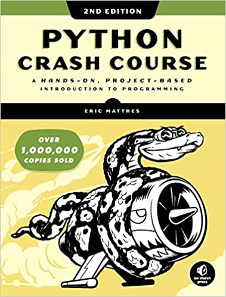
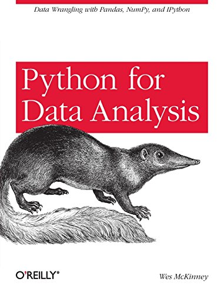
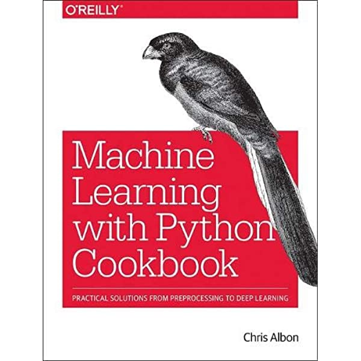

# Introduction to Python

This is a code replication for multiple intro Python textbooks: 

* [Python Crash Course](https://www.amazon.com/Python-Crash-Course-Hands-Project-Based/dp/1593276036) 
* [Python for Data Analysis](https://www.amazon.com/Python-Data-Analysis-Wrangling-IPython/dp/1491957662/ref=sr_1_1?crid=JYU2RLCE9Y9K&keywords=python+for+data+analysis&qid=1647150874&s=books&sprefix=python+for+data+analysis%2Cstripbooks%2C117&sr=1-1)
* [Machine Learning with Python Cookbook](https://www.amazon.com/Machine-Learning-Python-Cookbook-Preprocessing/dp/1491989386/ref=asc_df_1491989386/?tag=hyprod-20&linkCode=df0&hvadid=312114711253&hvpos=&hvnetw=g&hvrand=6379637140795528557&hvpone=&hvptwo=&hvqmt=&hvdev=c&hvdvcmdl=&hvlocint=&hvlocphy=1013962&hvtargid=pla-440699598191&psc=1)